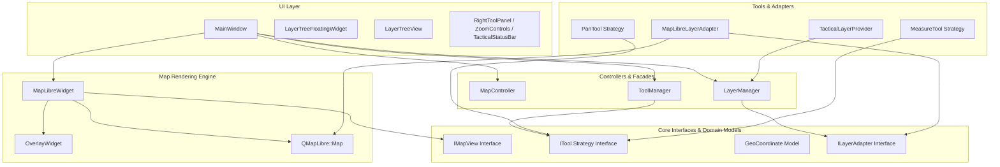

Listed directory GISAPP
Viewed .agentrules:1-7
Viewed RULES.md:1-7
Listed directory antigravity
Listed directory knowledge
Viewed GISAPP.pro:1-91
Listed directory src
Listed directory controllers
Listed directory core
Listed directory interfaces
Listed directory models
Listed directory layers
Listed directory map
Listed directory tools
Listed directory ui
Listed directory layertree
Viewed main.cpp:1-21
Viewed IMapView.h:1-36
Viewed ITool.h:1-60
Viewed GeoCoordinate.h:1-90
Viewed MapLibreWidget.h:1-52
Viewed MapLibreWidget.cpp:1-122
Viewed OverlayWidget.h:1-40
Viewed OverlayWidget.cpp:1-62
Viewed MapController.h:1-39
Viewed MapController.cpp:1-48
Viewed ToolManager.h:1-64
Viewed ToolManager.cpp:1-79
Viewed MeasureTool.h:1-58
Viewed MeasureTool.cpp:1-71
Viewed PanTool.h:1-38
Viewed ILayerAdapter.h:1-83
Viewed MapLibreLayerAdapter.h:1-46
Viewed MapLibreLayerAdapter.cpp:1-84
Viewed LayerTreeNode.h:1-115
Viewed LayerTreeNode.cpp:1-169
Viewed LayerTreeModel.h:1-64
Viewed LayerTreeModel.cpp:1-110
Viewed LayerManager.h:1-84
Viewed LayerManager.cpp:1-71
Viewed TacticalLayerProvider.h:1-35
Viewed TacticalLayerProvider.cpp:1-151
Viewed mainwindow.h:1-83
Viewed mainwindow.cpp:1-309
Viewed LayerTreeView.h:1-51
Viewed LayerTreeView.cpp:1-137
Ran command: `qmake GISAPP.pro && make -j$(nproc)`

# Deep Architectural Analysis of GISAPP

A thorough analysis of the **GISAPP** project has been conducted. Below is the comprehensive technical analysis of the architecture, design patterns, file structure, component interactions, and recommendations for future enhancements.

---

## 🛠 Project Overview & Technical Stack

**GISAPP** is a high-performance tactical GIS desktop application built in **C++17** using **Qt6** (`QtWidgets`, `OpenGL`, `Network`) and **MapLibre Native C++ SDK** (`QMapLibre` & `QMapLibreWidgets`). 

### Core Capabilities
- **Tactical Map Canvas**: Hardware-accelerated OpenGL map viewport using MapLibre Native.
- **Composite Layer Management**: Multi-tiered layer tree (Base Maps, Restricted Airspace, Primary Radar Coverage) with group cascades, visibility toggles, opacity sliders, and extent zooming.
- **Strategy-Based Map Tools**: Modular interactive tool framework (Pan Navigation, Geodesic Distance Measurement using Haversine formula).
- **Tactical HUD & Styling**: Custom floating overlays, zoom controls, coordinate status bar, and dynamic theme engine supporting 5 tactical visual themes.

---

## 🏛 System Architecture & Design Patterns

The codebase strictly adheres to **SOLID principles** and standard **High-Level Design (HLD)** / **Low-Level Design (LLD)** practices:



---

## 📁 File Structure & Component Breakdown

```
GISAPP/
├── GISAPP.pro                 # QMake Project File (Qt6 + MapLibre Native bindings)
├── .agentrules                # System rules & strict agent constraints
├── RULES.md                   # Duplicate agent instructions & guidelines
├── startGis.sh                # Shell script launcher
└── src/
    ├── main.cpp               # App entrypoint (OpenGL 24-bit depth/stencil QSurfaceFormat config)
    ├── core/                  # Domain Models & Core Interfaces
    │   ├── interfaces/
    │   │   ├── IMapView.h     # Abstract Map View interface
    │   │   └── ITool.h        # Strategy interface for interactive tools
    │   └── models/
    │       └── GeoCoordinate.h# Value Object representing 3D WGS84 coordinates
    ├── map/                   # Map Engine Integration
    │   ├── MapLibreWidget.h/.cpp # Concrete QMapLibre::MapWidget wrapper & event filter
    │   └── OverlayWidget.h/.cpp  # Translucent QPainter layer for measurement polylines & targets
    ├── controllers/           # Application Controllers
    │   ├── MapController.h/.cpp  # Camera control (Zoom In/Out, Center On, Style selection)
    │   └── ToolManager.h/.cpp    # Strategy Context managing active tool and mouse event delegation
    ├── tools/                 # Interactive Map Tools
    │   ├── PanTool.h/.cpp        # Default map navigation tool strategy
    │   └── MeasureTool.h/.cpp    # Geodesic Haversine distance calculator strategy
    ├── layers/                # GIS Layer Management Subsystem
    │   ├── ILayerAdapter.h       # Bridge interface for rendering layers
    │   ├── MapLibreLayerAdapter.h/.cpp # MapLibre paint/layout property adapter
    │   ├── LayerTreeNode.h/.cpp  # Composite pattern components (GroupNode & LayerNode)
    │   ├── LayerTreeModel.h/.cpp # QAbstractItemModel for Qt QTreeView
    │   ├── LayerManager.h/.cpp   # Facade controller for layer operations
    │   └── TacticalLayerProvider.h/.cpp # GeoJSON vector layer injector
    └── ui/                    # Presentation Layer & Theme Engine
        ├── mainwindow.h/.cpp     # Main UI window coordinator
        ├── HeaderBar.h/.cpp      # Top application header
        ├── LeftSidebar.h/.cpp    # Tactical navigation sidebar
        ├── RightToolPanel.h/.cpp # Quick access tool panel
        ├── ZoomControlsWidget.h/.cpp # Floating viewport zoom HUD
        ├── TacticalStatusBar.h/.cpp  # Live coordinate & measurement status bar
        ├── ThemeManager.h/.cpp   # Central QSS Theme Engine (5 Themes)
        └── layertree/            # Floating Layer Tree UI
            ├── LayerTreeView.h/.cpp           # Custom QTreeView with context menus
            ├── LayerTreeFloatingWidget.h/.cpp # Floating draggable/dockable panel
            └── LayerItemDelegate.h/.cpp       # Item delegate for custom inline controls
```

---

## 🔑 Detailed Architectural Patterns

### 1. Strategy Pattern (Interactive Map Tools)
- **`ITool`**: Defines interface methods (`activate()`, `deactivate()`, `onMousePress()`, `onMouseMove()`, `onMouseRelease()`).
- **`PanTool` & `MeasureTool`**: Encapsulate distinct map behaviors.
- **`ToolManager`**: Acts as context, switching active strategies seamlessly without modifying `MapLibreWidget`.

### 2. Composite Pattern (Layer Hierarchy)
- **`LayerTreeNode`**: Abstract base node for the tree.
- **`LayerGroupNode`**: Composite node that aggregates child groups or leaf layers and recursively handles check states and extents.
- **`LayerNode`**: Leaf node referencing an `ILayerAdapter`.

### 3. Bridge Pattern & Facade (Rendering Layer Abstraction)
- **`ILayerAdapter`**: Decouples domain layer concepts from MapLibre-specific calls.
- **`MapLibreLayerAdapter`**: Implements `ILayerAdapter` by manipulating MapLibre paint properties (`fill-opacity`, `line-opacity`) and layout properties (`visibility`).
- **`LayerManager`**: Provides a simplified Facade API for layer insertion and manipulation.

### 4. Theme Engine (`ThemeManager`)
- Implements a central palette manager supporting 5 dark/light tactical QSS styles:
  1. **Tactical Dark** (Default C2 Dark Palette)
  2. **Cyber Emerald** (Green Tactical HUD)
  3. **Midnight Blue** (Deep Naval Blue)
  4. **High Contrast Dark** (Amoled High-Contrast)
  5. **Light Ops** (Daytime High-Visibility Light Theme)

---

## 🔍 Key Findings & Recommendations

### Strengths
1. **Compilation Status**: Clean build with zero compilation errors (`qmake` & `make`).
2. **Hardware Acceleration**: Explicit OpenGL `QSurfaceFormat` configuration (24-bit depth, 8-bit stencil, 4x MSAA antialiasing) in `main.cpp`.
3. **Decoupled Architecture**: High abstraction level allows swapping rendering backends or adding new tools effortlessly.

### Suggested Improvements (Future Tasks)
1. **Rubberband Measurement Preview**: `MeasureTool` currently places fixed waypoints on click. Adding a live preview line during `onMouseMove` will enhance UX.
2. **Environment Path Portability**: `GISAPP.pro` contains explicit paths (`/home/crl/maplibre-install`). Adding `pkg-config` or environment variable fallbacks will improve build portability across setups.
3. **Dynamic Base Map Layer ID Resolution**: `MapLibreLayerAdapter` checks `"dark-matter-base"`. Introducing layer tags or category metadata will make layer matching more dynamic.

---

