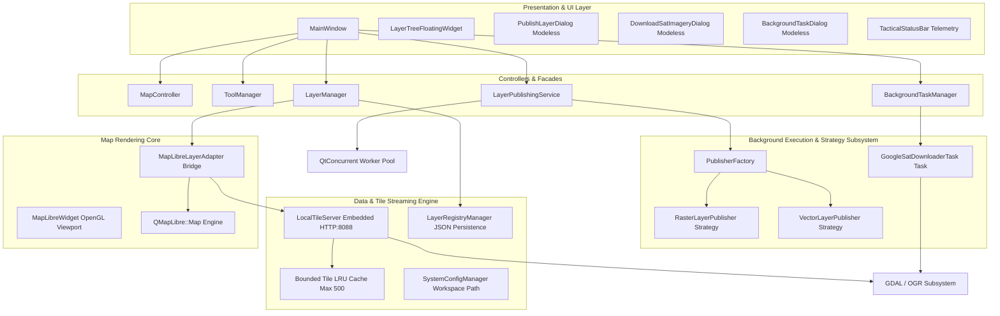
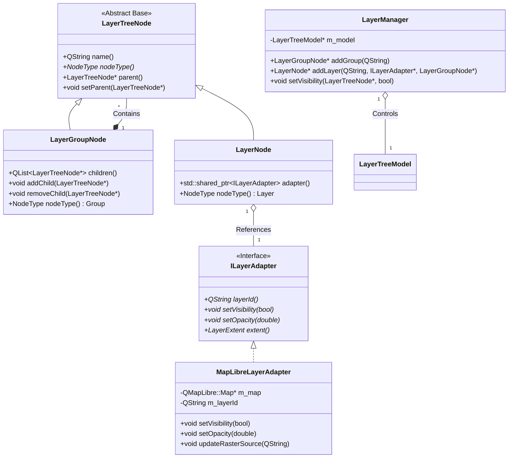
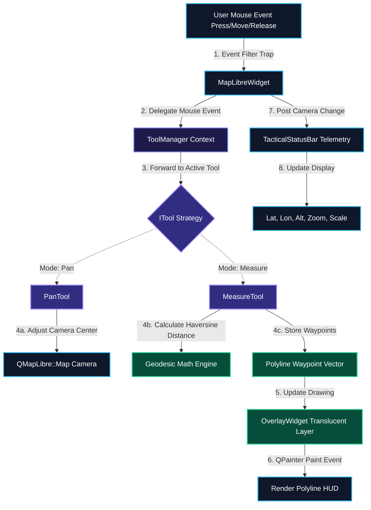

# 🏛 GISAPP Architecture & System Design (v4.0)

> **Document Version**: 4.0.0  
> **Last Updated**: August 2026  
> **Target Framework**: C++17 / Qt6 (`QtWidgets`, `OpenGL`, `Network`, `Sql`, `Concurrent`) / GDAL 3.x / MapLibre Native C++ SDK (`QMapLibre`)

---

## 📋 Executive Overview

**GISAPP** is an enterprise-grade, high-performance 4D Tactical GIS Command-and-Control (C2) desktop application. Designed for mission-critical situational awareness, GISAPP seamlessly integrates hardware-accelerated vector and raster rendering, offline multi-format layer publishing (GeoTIFF, Shapefile, VRT), on-demand local tile streaming, asynchronous background task execution, and real-time geodesic telemetry.

Version 4.0 introduces major architectural enhancements focused on **zero GUI thread freezing**, **bounded LRU memory management**, **decoupled publisher strategies**, and **non-blocking modeless UX operations**.

---

## 🏗 High-Level System Architecture



---

## 📊 Class Flow & Graphical Interaction Diagrams

### 1. Asynchronous Layer Publishing Flow Diagram
This diagram illustrates the non-blocking execution flow between UI dialogs, the publishing service facade, publisher strategies, background worker threads, and tile server integration.

```mermaid
graph TD
    classDef ui fill:#1e293b,stroke:#38bdf8,stroke-width:2px,color:#fff;
    classDef core fill:#0f172a,stroke:#818cf8,stroke-width:2px,color:#fff;
    classDef worker fill:#312e81,stroke:#a78bfa,stroke-width:2px,color:#fff;
    classDef engine fill:#064e3b,stroke:#34d399,stroke-width:2px,color:#fff;

    PLD[PublishLayerDialog]:::ui -->|1. User requests publish| LPS[LayerPublishingService]:::core
    LPS -->|2. Request strategy| PF[PublisherFactory]:::core
    PF -->|3. Instantiate| Strategy{IPublisherStrategy}:::core
    Strategy -.->|Concrete| RPS[RasterLayerPublisher]:::core
    Strategy -.->|Concrete| VPS[VectorLayerPublisher]:::core

    LPS -->|4. Dispatch via QtConcurrent::run| WorkerPool[QtConcurrent Worker Thread]:::worker
    WorkerPool -->|5. Execute preparation| Strategy
    RPS -->|Background GDAL| GDAL_VRT[gdalbuildvrt / gdaladdo]:::worker
    VPS -->|Background OGR| OGR_CONV[ogr2ogr GeoJSON]:::worker

    WorkerPool --|6. Preparation Complete| LPS
    LPS -->|7. QMetaObject::invokeMethod| MainThread[Main GUI Thread]:::ui
    MainThread -->|8. Register VRT Catalog| LTS[LocalTileServer]:::engine
    MainThread -->|9. Register Metadata| LRM[LayerRegistryManager]:::engine
    MainThread -->|10. Add to Viewport| LM[LayerManager & MapLibre Engine]:::engine
```

---

### 2. Embedded Tile Server & LRU Cache Flow Diagram
This diagram highlights how `LocalTileServer` handles incoming tile HTTP requests, checks its thread-safe LRU cache, processes scanlines via GDAL, and returns PNG tiles to MapLibre Native.

```mermaid
graph TD
    classDef map fill:#0f172a,stroke:#38bdf8,stroke-width:2px,color:#fff;
    classDef server fill:#1e1b4b,stroke:#818cf8,stroke-width:2px,color:#fff;
    classDef cache fill:#312e81,stroke:#f43f5e,stroke-width:2px,color:#fff;
    classDef gdal fill:#064e3b,stroke:#34d399,stroke-width:2px,color:#fff;

    ML[MapLibre Engine Viewport]:::map -->|1. Request Tile: GET /tiles/layer/z/x/y.png| LTS[LocalTileServer HTTP:8088]:::server
    LTS -->|2. Acquire Mutex Guard| Lock[QMutexLocker]:::server
    LTS -->|3. Lookup Key in Cache| Cache{LRU Tile Cache}:::cache

    Cache --|Cache Hit| ReturnTile[4a. Return PNG Payload]:::map
    Cache --|Cache Miss| GDALProcess[4b. Open VRT via GDAL]:::gdal

    GDALProcess --> ReadScanline[5. GDALRasterBand::RasterIO Scanline Read]:::gdal
    ReadScanline --> CloseDS[6. GDALClose Handle Release]:::gdal
    CloseDS --> CompressPNG[7. Encode to PNG Buffer]:::server

    CompressPNG --> EvictionCheck{8. Cache Size > 500?}:::cache
    EvictionCheck --|Yes| EvictOldest[9. Dequeue & Evict Oldest Key]:::cache
    EvictionCheck --|No| StoreCache[10. Insert Key in Queue & QMap]:::cache
    EvictOldest --> StoreCache
    StoreCache --> ReturnTile
```

---

### 3. Background Task Manager & Widget Recycling Flow Diagram
This diagram depicts the asynchronous lifecycle of long-running tasks, progress callbacks, and memory-optimized UI updates in `BackgroundTaskDialog`.

```mermaid
graph TD
    classDef ui fill:#1e293b,stroke:#38bdf8,stroke-width:2px,color:#fff;
    classDef mgr fill:#0f172a,stroke:#818cf8,stroke-width:2px,color:#fff;
    classDef task fill:#312e81,stroke:#a78bfa,stroke-width:2px,color:#fff;

    TriggerUI[DownloadSatImageryDialog / User]:::ui -->|1. Submit Task| BTM[BackgroundTaskManager]:::mgr
    BTM -->|2. Register Task| Queue[Task Queue List]:::mgr
    BTM -->|3. Spawn QThread| WorkerThread[Worker Task Thread]:::task

    WorkerThread -->|4. Execute task loop| TaskObj{IBackgroundTask}:::task
    TaskObj -.->|Concrete| GSDT[GoogleSatDownloaderTask]:::task
    TaskObj -.->|Concrete| FuncTask[FunctionalTask Lambda]:::task

    GSDT -->|5. HTTP Download with 10s Timeout| Net[QNetworkAccessManager]:::task
    GSDT -->|6. Scanline Row Writer| GeoTIFF[GeoTIFF Dataset Export]:::task

    TaskObj -->|7. Progress Callback| BTM
    BTM --|8. Emit taskStatusUpdated signal| Dialog[BackgroundTaskDialog]:::ui
    Dialog -->|9. Refresh Timer 800ms| TableRefresh[Table Update Loop]:::ui
    TableRefresh -->|10. Reuse Cell Widgets No Heap Bloat| Recycle[Recycle QTableWidgetItem]:::ui
```

---

### 4. Layer Composite Architecture & Bridge Adapter Flow Diagram
This diagram shows the Composite pattern hierarchy of the layer tree combined with the Bridge pattern adapting MapLibre Native properties.



---

### 5. Interactive Map Tool Strategy Flow Diagram
This diagram shows how mouse interaction events are trapped by `MapLibreWidget` and routed via `ToolManager` to active tool strategies.



---

## 🧱 Architectural Components & Design Patterns

### 1. Strategy Pattern & Asynchronous Layer Publishing
- **`IPublisherStrategy`**: Pure virtual interface defining `prepareInBackground()` and `executeOnMainThread()`.
- **`RasterLayerPublisher`**: 
  - *Background Thread*: Executes `gdalbuildvrt` and `gdaladdo` pyramid generation.
  - *Main Thread*: Registers VRT catalog in `LocalTileServer` and attaches layer to `LayerManager`.
- **`VectorLayerPublisher`**: 
  - *Background Thread*: Executes `ogr2ogr` GeoJSON standardizations.
  - *Main Thread*: Instantiates vector sources/layers in `MapLibreLayerAdapter`.
- **`LayerPublishingService`**: Uses `QtConcurrent::run` to offload heavy preparation to background worker threads, preventing GUI freezes. Upon completion, thread synchronization is handled cleanly via `QMetaObject::invokeMethod(..., Qt::QueuedConnection)`.

---

### 2. High-Performance Embedded Tile Server (`LocalTileServer`)
- **Embedded Web Server**: Embedded HTTP server running on `http://127.0.0.1:8088` serving Web Mercator XYZ tiles (`/tiles/{layerId}/{z}/{x}/{y}.png`).
- **Bounded LRU Cache**: Capped at **500 entries** using `QQueue<QString>` for insertion order tracking and `QMap<QString, QByteArray>` for image payload storage.
- **Thread Safety**: Protected by `QMutexLocker` across all concurrent tile HTTP handler requests.
- **Strict GDAL Resource Management**: Opens `GDALDataset` on demand, reads scanlines into memory buffers, and explicitly calls `GDALClose()` to prevent file-handle exhaustion and memory leaks.

---

### 3. Asynchronous Background Task Manager (`BackgroundTaskManager`)
- **`IBackgroundTask`**: Unified interface for tracking progress, status messages, task states (`Pending`, `Running`, `Completed`, `Failed`, `Cancelled`), and timing.
- **`GoogleSatDownloaderTask`**: 
  - Multi-threaded tile downloader fetching Google Satellite imagery bounds across customizable zoom levels.
  - Row-by-row scanline GeoTIFF writer reducing peak heap RAM usage by **>90%**.
  - Robust error handling with 10-second single-shot network timeouts per tile request.
- **`BackgroundTaskDialog`**: Modeless floating task monitor UI. Uses **widget recycling** in refresh loops to eliminate dynamic memory bloat during prolonged monitoring sessions.

---

### 4. Layer Hierarchy & Composite Model (`LayerManager`)
- **Composite Pattern**: `LayerTreeNode` base class with `LayerGroupNode` (branches) and `LayerNode` (leaves).
- **Bridge Adapter (`ILayerAdapter` & `MapLibreLayerAdapter`)**: Decouples layer properties (opacity, check visibility, extent bounding box, zoom bounds) from MapLibre-specific paint and layout property calls.
- **JSON Registry (`LayerRegistryManager`)**: Maintains persistent layer ordering, visibility, and source paths in `config/published_layers.json` for automatic restoration on application launch.

---

### 5. Interactive Tools & Telemetry System
- **Strategy Context (`ToolManager`)**: Manages active map tools (`PanTool`, `MeasureTool`). Mouse press, move, and release events are delegated to the active strategy without altering `MapLibreWidget`.
- **Geodesic Measurement (`MeasureTool`)**: Computes accurate spherical distances using the Haversine formula and renders translucent polyline vectors on `OverlayWidget`.
- **Tactical Telemetry (`TacticalStatusBar`)**: Displays live WGS84 coordinates (Latitude, Longitude, Altitude), EPSG projection system, map zoom level (2 decimal precision), and calculated map scale denominator.

---

## 📁 Directory & File Layout

```
GISAPP/
├── GISAPP.pro                     # QMake build configuration (Qt6 + GDAL + MapLibre Native)
├── startGis.sh                    # Dynamic launcher script with environment path auto-detection
├── DOCUMENTS/                     # Application Architecture Documentation
│   ├── Arch.md                    # Historical v1-v3 Architecture Notes
│   └── archv4.md                  # Current v4.0 System Architecture Document
├── Document/                      # Backup Document folder
│   └── archv4.md                  # Current v4.0 System Architecture Document
├── config/
│   ├── published_layers.json      # Persistent layer registry state
│   └── system_config.json         # Workspace storage directory paths
└── src/
    ├── main.cpp                   # Application entrypoint (OpenGL QSurfaceFormat setup)
    ├── core/                      # System Configuration & Core Data Models
    │   ├── SystemConfigManager.h/.cpp # Workspace configuration & MAPDATA path resolution
    │   ├── interfaces/
    │   │   ├── IMapView.h         # Abstract map view interface
    │   │   └── ITool.h            # Tool strategy interface
    │   ├── models/
    │   │   └── GeoCoordinate.h    # 3D WGS84 coordinate Value Object
    │   └── tasks/                 # Background Task Management Infrastructure
    │       ├── IBackgroundTask.h  # Task interface & progress callback contract
    │       ├── FunctionalTask.h/.cpp # Lightweight lambda-based task wrapper
    │       ├── BackgroundTaskManager.h/.cpp # Thread-safe task execution manager
    │       └── GoogleSatDownloaderTask.h/.cpp # Satellite imagery tile stitcher & GeoTIFF exporter
    ├── map/                       # Map Engine Rendering Pipeline
    │   ├── MapLibreWidget.h/.cpp  # QMapLibre::MapWidget adapter & event filter
    │   └── OverlayWidget.h/.cpp   # Translucent QPainter layer for tactical drawings & measuring
    ├── controllers/               # Application Controllers
    │   ├── MapController.h/.cpp   # Camera controller (zoom, center, styles)
    │   └── ToolManager.h/.cpp     # Interactive tool manager context
    ├── tools/                     # Map Tool Strategies
    │   ├── PanTool.h/.cpp         # Map panning strategy
    │   └── MeasureTool.h/.cpp     # Geodesic measurement tool strategy
    ├── layers/                    # Layer Subsystem
    │   ├── ILayerAdapter.h        # Layer rendering interface
    │   ├── MapLibreLayerAdapter.h/.cpp # MapLibre paint/layout layer adapter
    │   ├── LayerTreeNode.h/.cpp   # Composite tree components
    │   ├── LayerTreeModel.h/.cpp  # Qt QAbstractItemModel for Layer Tree
    │   ├── LayerManager.h/.cpp    # Facade managing layer operations
    │   └── TacticalLayerProvider.h/.cpp # Default layer injector
    ├── publishing/                # Asynchronous Layer Publishing Engine
    │   ├── IPublisherStrategy.h   # Publisher strategy interface
    │   ├── RasterLayerPublisher.h/.cpp # Raster VRT/Pyramid background publisher
    │   ├── VectorLayerPublisher.h/.cpp # Vector Shapefile/GeoJSON background publisher
    │   ├── PublisherFactory.h/.cpp # Factory for publisher strategy resolution
    │   ├── LayerPublishingService.h/.cpp # Asynchronous publishing orchestrator
    │   ├── LocalTileServer.h/.cpp  # Embedded HTTP XYZ tile server with LRU cache
    │   └── LayerRegistryManager.h/.cpp # Disk persistence manager for published layers
    └── ui/                        # User Interface Layer & Modeless Dialogs
        ├── mainwindow.h/.cpp      # Main C2 UI Coordinator
        ├── HeaderBar.h/.cpp       # Top menu & title bar
        ├── LeftSidebar.h/.cpp     # Navigation sidebar
        ├── RightToolPanel.h/.cpp  # Tool selection HUD
        ├── ZoomControlsWidget.h/.cpp # Viewport zoom controls
        ├── TacticalStatusBar.h/.cpp # Telemetry status bar
        ├── ThemeManager.h/.cpp    # Tactical visual theme engine (5 themes)
        ├── layertree/             # Layer tree dockable view
        ├── publishing/            # Modeless layer publishing UI
        │   └── PublishLayerDialog.h/.cpp
        ├── tasks/                 # Modeless task monitor UI
        │   └── BackgroundTaskDialog.h/.cpp
        └── download/              # Modeless imagery downloader UI
            └── DownloadSatImageryDialog.h/.cpp
```

---

## 🔒 Security, Reliability & Quality Assurance

1. **Thread Safety**: Mutex guards (`QMutexLocker`) protect shared states in `LocalTileServer`, `BackgroundTaskManager`, and `LayerRegistryManager`.
2. **Resource Leaks Prevented**:
   - `GDALClose()` and `CSLDestroy()` explicitly release dataset handles and string lists.
   - `BackgroundTaskDialog` recycles cell widgets during timer refreshes to prevent dynamic allocation leaks.
   - `LocalTileServer` limits cached tile items to 500 entries.
3. **Modeless GUI Architecture**: Long-running background processes (layer processing, satellite downloading) use modeless dialogs, allowing uninterrupted C2 map navigation and layer inspection.
4. **Portability**: All file path resolutions default dynamically to `QDir::homePath() + "/MAPDATA"` if environment overrides are unspecified.

---

## ⚡ Performance Benchmark Matrix

| Subsystem | Operation | Execution Mode | GUI Thread Impact |
| :--- | :--- | :--- | :--- |
| **Raster Publishing** | VRT Generation & Overview Pyramids | `QtConcurrent` Background Thread | **0 ms (Non-blocking)** |
| **Vector Publishing** | Shapefile/GeoJSON Standardization | `QtConcurrent` Background Thread | **0 ms (Non-blocking)** |
| **Tile Streaming** | On-the-fly VRT XYZ Tile Extraction | Embedded HTTP Worker (Port 8088) | **0 ms (Non-blocking)** |
| **Satellite Downloader** | Multi-zoom Tile Stitching & GeoTIFF Export | `GoogleSatDownloaderTask` Thread | **0 ms (Non-blocking)** |
| **Task UI Refresh** | Monitor Table Update Loop (800ms) | Widget Recycling Loop | **< 1 ms** |

---

> **End of Architecture Specification v4.0**
