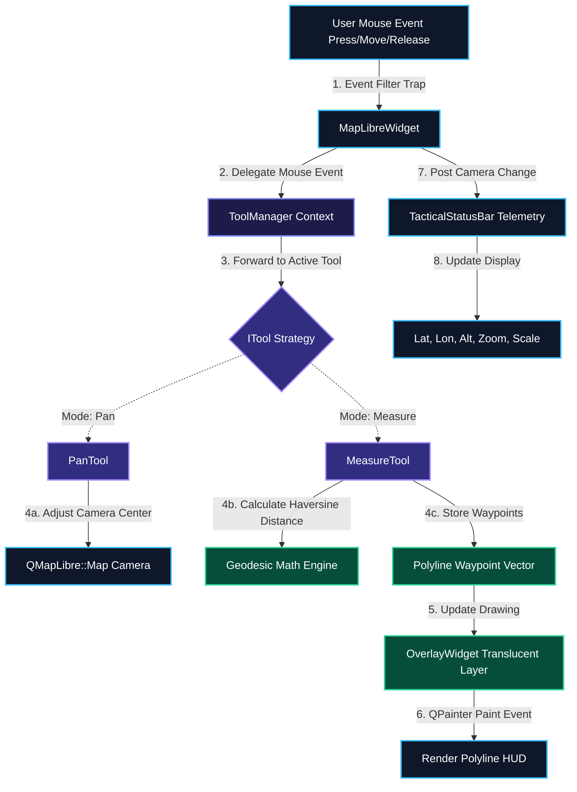

# 🏛 GISAPP Architecture & System Design Specification (v5.0)

> **Document Version**: 5.0.0  
> **Last Updated**: August 2026  
> **Target Framework**: C++17 / Qt6 (`QtWidgets`, `OpenGL`, `Network`, `Sql`, `Concurrent`, `Xml`, `Core`) / GDAL 3.x / MapLibre Native C++ SDK (`QMapLibre`)

---

## 📋 Executive Overview & What's New in Version 5.0

**GISAPP** is an enterprise-grade, high-performance 4D Tactical GIS Command-and-Control (C2) desktop application. Engineered for mission-critical situational awareness, GISAPP seamlessly integrates hardware-accelerated vector and raster rendering, real-time spatial telemetry ingestion, offline multi-format layer publishing (GeoTIFF, Shapefile, VRT), on-demand local tile streaming, asynchronous background task execution, and dynamic entity management.

### 🚀 Major Architectural Advancements in Version 5.0

1. **Unified Polymorphic Entity Management System (EMS)**:
   - Replaced fragmented entity implementations with a SOLID-compliant polymorphic architecture.
   - Introduced single-point registration (`GisEntityRegistry`) for custom entity types, enabling zero-core-modification extensibility.
   - Implemented dynamic attribute schema declarations (`EntityPropertySchema`) supporting runtime property binding.

2. **Schema-Agnostic Generic Repository & SQLite Persistence Engine**:
   - Built `GenericEntityRepository` backed by SQLite JSON serialization (`gis_entities` table), eliminating manual table migrations for custom spatial entities.
   - Integrated reactive signal dispatching (`entityAdded`, `entityUpdated`, `entityRemoved`, `repositoryCleared`) for instant cross-subsystem synchronization.

3. **Automated GeoJSON MapLibre Rendering Adapter**:
   - Implemented `MapLibreGenericEntityAdapter` using the Strategy pattern to automate source management and rendering for all generic entities, removing per-entity rendering adapter code.

4. **Universal Dynamic Property Inspector UI**:
   - Designed `UniversalEntityEditorDialog`, which auto-generates dark-themed Qt form inspectors based on entity property schemas (DoubleSpinBox for numeric attributes, Color buttons for styles, ComboBoxes for enums, LineEdits for strings).

5. **Real-Time Synchronized Track & Sector Telemetry**:
   - Resolved layer lifecycle and state reset issues for real-time track CSV ingestion (`CsvTrackIngestor`, `TrackRepository`) and sector XML ingestion (`XmlAreaOfViewIngestor`, `AreaOfViewRepository`).
   - Wired live deletion/clearing signals from table dialogs directly to MapLibre adapters, ensuring map viewport updates without application restarts.

6. **Strategy-Based Notification Engine**:
   - Integrated `NotificationManager` singleton driving `FlashNotificationStrategy` (non-blocking top-right map HUD toasts) and `CriticalNotificationStrategy` (modal system alerts).

---

## 🏗 High-Level System Architecture (v5.0 Complete Graph)

```mermaid
graph TD
    subgraph Presentation & UI Layer
        MW[MainWindow C2 Coordinator]
        LTF[LayerTreeFloatingWidget]
        PLD[PublishLayerDialog Modeless]
        DSD[DownloadSatImageryDialog Modeless]
        BTD[BackgroundTaskDialog Modeless]
        TTD[TracksTableDialog Modeless]
        AOV[AreaOfViewTableDialog Modeless]
        UED[UniversalEntityEditorDialog Modeless/Modal]
        TSB[TacticalStatusBar Telemetry]
        OW[OverlayWidget Translucent HUD]
        TM_UI[ThemeManager Dark Styling]
    end

    subgraph Controllers & Facades
        MC[MapController]
        TM[ToolManager Strategy Context]
        LM[LayerManager Composite]
        LPS[LayerPublishingService Facade]
        BTM[BackgroundTaskManager]
        NM[NotificationManager Singleton]
    end

    subgraph Unified Entity Management System EMS
        GER[GisEntityRegistry Factory]
        GE[GenericGisEntity Model]
        IGEO[IGisGeometry Interface]
        GREPO[GenericEntityRepository SQLite JSON]
        MGA[MapLibreGenericEntityAdapter Engine]
    end

    subgraph Telemetry & Track Subsystems
        TR[TrackRepository SQLite]
        MTA[MapLibreTrackAdapter]
        CTI[CsvTrackIngestor]
        AVR[AreaOfViewRepository SQLite]
        MAA[MapLibreAreaOfViewAdapter]
        XAI[XmlAreaOfViewIngestor]
    end

    subgraph Background Execution & Strategy Subsystem
        PF[PublisherFactory]
        RPS[RasterLayerPublisher Strategy]
        VPS[VectorLayerPublisher Strategy]
        GSDT[GoogleSatDownloaderTask Task]
        FNC[FlashNotificationStrategy Toast]
        CNS[CriticalNotificationStrategy Alert]
    end

    subgraph Data & Tile Streaming Engine
        LTS[LocalTileServer Embedded HTTP:8088]
        LRM[LayerRegistryManager JSON Persistence]
        LRU[Bounded Tile LRU Cache Max 500]
        DBM[DatabaseManager SQLite]
        SCM[SystemConfigManager Workspace Path]
    end

    subgraph Map Rendering Core
        MLW[MapLibreWidget OpenGL Viewport]
        MLA[MapLibreLayerAdapter Bridge]
        QML[QMapLibre::Map Engine]
    end

    MW --> MC
    MW --> TM
    MW --> LM
    MW --> LPS
    MW --> BTM
    MW --> NM

    MW --> GREPO
    MW --> TR
    MW --> AVR

    NM --> FNC
    NM --> CNS

    LPS --> PF
    PF --> RPS
    PF --> VPS
    LPS --> QtConcurrent[QtConcurrent Worker Pool]

    BTM --> GSDT
    GSDT --> GDAL[GDAL / OGR Subsystem]

    GER --> GE
    GE --> IGEO
    GREPO --> DBM
    MGA --> GREPO
    MGA --> QML

    TR --> DBM
    MTA --> TR
    MTA --> QML
    CTI --> TR

    AVR --> DBM
    MAA --> AVR
    MAA --> QML
    XAI --> AVR

    LM --> LRM
    LM --> MLA
    MLA --> QML
    MLA --> LTS

    LTS --> LRU
    LTS --> GDAL
```



---

## 📊 Class Flow & Detailed Interaction Diagrams

### 1. Unified Entity Management System (EMS) Lifecycle Diagram
This sequence illustrates single-step entity type registration, instantiation, SQLite JSON persistence, reactive signal dispatching, automated MapLibre GeoJSON rendering, and universal property editing.

```mermaid
graph TD
    classDef registry fill:#1e293b,stroke:#38bdf8,stroke-width:2px,color:#fff;
    classDef model fill:#0f172a,stroke:#818cf8,stroke-width:2px,color:#fff;
    classDef repo fill:#312e81,stroke:#a78bfa,stroke-width:2px,color:#fff;
    classDef map fill:#064e3b,stroke:#34d399,stroke-width:2px,color:#fff;
    classDef ui fill:#4c1d95,stroke:#c084fc,stroke-width:2px,color:#fff;

    Developer[1. Define EntityTypeDescriptor]:::registry -->|registerEntityType| Registry[GisEntityRegistry Singleton]:::registry
    Registry -->|2. Register Schema & Style| RegStore[Internal Descriptors Map]:::registry

    UserClick[3. User Right-Clicks Map / Triggers Action]:::ui -->|createEntity| Registry
    Registry -->|4. Instantiate Default Model| Entity[GenericGisEntity]:::model
    Entity -->|5. Attach Geometry| Geom[PointGeometry / PolygonGeometry]:::model

    UserClick -->|6. Show Auto Form| Dialog[UniversalEntityEditorDialog]:::ui
    Dialog -->|7. Bind PropertySchemas to Widgets| Widgets[DoubleSpinBox / ColorPicker / ComboBox]:::ui

    Dialog --|8. User Saves Form| Repo[GenericEntityRepository]:::repo
    Repo -->|9. Serialize to JSON & Save| SQLite[(SQLite gis_entities Table)]:::repo
    Repo -->|10. Emit entityAdded / entityUpdated| Adapter[MapLibreGenericEntityAdapter]:::map

    Adapter -->|11. Rebuild GeoJSON FeatureCollection| GeoJSON[GeoJSON Memory Buffer]:::map
    Adapter -->|12. Update MapLibre Source & Layer| MapLibre[QMapLibre::Map Viewport]:::map
```

---

### 2. Real-Time Telemetry Ingestion & Synchronized Map Rendering
This diagram highlights how CSV track records and XML area-of-view sectors are ingested, committed to SQLite, and immediately reflected across table views and the MapLibre map viewport.

```mermaid
graph TD
    classDef ingest fill:#1e1b4b,stroke:#818cf8,stroke-width:2px,color:#fff;
    classDef repo fill:#0f172a,stroke:#38bdf8,stroke-width:2px,color:#fff;
    classDef map fill:#064e3b,stroke:#34d399,stroke-width:2px,color:#fff;
    classDef ui fill:#312e81,stroke:#a78bfa,stroke-width:2px,color:#fff;

    CSV[Track CSV File]:::ingest -->|1. Parse Records| CsvIngestor[CsvTrackIngestor]:::ingest
    XML[Area of View XML File]:::ingest -->|1. Parse Sectors| XmlIngestor[XmlAreaOfViewIngestor]:::ingest

    CsvIngestor -->|2. Batch Insert| TrackRepo[TrackRepository]:::repo
    XmlIngestor -->|2. Batch Insert| AovRepo[AreaOfViewRepository]:::repo

    TrackRepo -->|3. Commit Transaction| SQLite[(SQLite Database)]:::repo
    AovRepo -->|3. Commit Transaction| SQLite

    TrackRepo -->|4. Emit tracksUpdated signal| TrackAdapter[MapLibreTrackAdapter]:::map
    AovRepo -->|4. Emit aovUpdated signal| AovAdapter[MapLibreAreaOfViewAdapter]:::map

    TrackRepo -->|5. Notify Table Model| TracksDialog[TracksTableDialog]:::ui
    AovRepo -->|5. Notify Table Model| AovDialog[AreaOfViewTableDialog]:::ui

    TrackAdapter -->|6. Set Source GeoJSON| MapEngine[QMapLibre::Map Viewport]:::map
    AovAdapter -->|6. Set Source GeoJSON| MapEngine

    TracksDialog --|User Deletes / Clears| TrackRepo
    AovDialog --|User Deletes / Clears| AovRepo
```

---

### 3. Asynchronous Layer Publishing Strategy & Worker Pool Flow
This diagram illustrates the non-blocking execution flow between UI dialogs, the publishing service facade, publisher strategies, background worker threads, and tile server integration.

```mermaid
graph TD
    classDef ui fill:#1e293b,stroke:#38bdf8,stroke-width:2px,color:#fff;
    classDef core fill:#0f172a,stroke:#818cf8,stroke-width:2px,color:#fff;
    classDef worker fill:#312e81,stroke:#a78bfa,stroke-width:2px,color:#fff;
    classDef engine fill:#064e3b,stroke:#34d399,stroke-width:2px,color:#fff;

    PLD[PublishLayerDialog]:::ui -->|1. User requests publish| LPS[LayerPublishingService]:::core
    LPS -->|2. Request strategy| PF[PublisherFactory]:::core
    PF -->|3. Instantiate| Strategy{IPublisherStrategy}:::core
    Strategy -.->|Concrete| RPS[RasterLayerPublisher]:::core
    Strategy -.->|Concrete| VPS[VectorLayerPublisher]:::core

    LPS -->|4. Dispatch via QtConcurrent::run| WorkerPool[QtConcurrent Worker Thread]:::worker
    WorkerPool -->|5. Execute preparation| Strategy
    RPS -->|Background GDAL| GDAL_VRT[gdalbuildvrt / gdaladdo]:::worker
    VPS -->|Background OGR| OGR_CONV[ogr2ogr GeoJSON]:::worker

    WorkerPool --|6. Preparation Complete| LPS
    LPS -->|7. QMetaObject::invokeMethod| MainThread[Main GUI Thread]:::ui
    MainThread -->|8. Register VRT Catalog| LTS[LocalTileServer]:::engine
    MainThread -->|9. Register Metadata| LRM[LayerRegistryManager]:::engine
    MainThread -->|10. Add to Viewport| LM[LayerManager & MapLibre Engine]:::engine
```

---

### 4. Embedded Tile Server & LRU Cache Flow Diagram
This diagram highlights how `LocalTileServer` handles incoming tile HTTP requests, checks its thread-safe LRU cache, processes scanlines via GDAL, and returns PNG tiles to MapLibre Native.

```mermaid
graph TD
    classDef map fill:#0f172a,stroke:#38bdf8,stroke-width:2px,color:#fff;
    classDef server fill:#1e1b4b,stroke:#818cf8,stroke-width:2px,color:#fff;
    classDef cache fill:#312e81,stroke:#f43f5e,stroke-width:2px,color:#fff;
    classDef gdal fill:#064e3b,stroke:#34d399,stroke-width:2px,color:#fff;

    ML[MapLibre Engine Viewport]:::map -->|1. Request Tile: GET /tiles/layer/z/x/y.png| LTS[LocalTileServer HTTP:8088]:::server
    LTS -->|2. Acquire Mutex Guard| Lock[QMutexLocker]:::server
    LTS -->|3. Lookup Key in Cache| Cache{LRU Tile Cache}:::cache

    Cache --|Cache Hit| ReturnTile[4a. Return PNG Payload]:::map
    Cache --|Cache Miss| GDALProcess[4b. Open VRT via GDAL]:::gdal

    GDALProcess --> ReadScanline[5. GDALRasterBand::RasterIO Scanline Read]:::gdal
    ReadScanline --> CloseDS[6. GDALClose Handle Release]:::gdal
    CloseDS --> CompressPNG[7. Encode to PNG Buffer]:::server

    CompressPNG --> EvictionCheck{8. Cache Size > 500?}:::cache
    EvictionCheck --|Yes| EvictOldest[9. Dequeue & Evict Oldest Key]:::cache
    EvictionCheck --|No| StoreCache[10. Insert Key in Queue & QMap]:::cache
    EvictOldest --> StoreCache
    StoreCache --> ReturnTile
```

---

### 5. Asynchronous Background Task Manager & Widget Recycling Diagram
This diagram depicts the asynchronous lifecycle of long-running tasks, progress callbacks, and memory-optimized UI updates in `BackgroundTaskDialog`.

```mermaid
graph TD
    classDef ui fill:#1e293b,stroke:#38bdf8,stroke-width:2px,color:#fff;
    classDef mgr fill:#0f172a,stroke:#818cf8,stroke-width:2px,color:#fff;
    classDef task fill:#312e81,stroke:#a78bfa,stroke-width:2px,color:#fff;

    TriggerUI[DownloadSatImageryDialog / User]:::ui -->|1. Submit Task| BTM[BackgroundTaskManager]:::mgr
    BTM -->|2. Register Task| Queue[Task Queue List]:::mgr
    BTM -->|3. Spawn QThread| WorkerThread[Worker Task Thread]:::task

    WorkerThread -->|4. Execute task loop| TaskObj{IBackgroundTask}:::task
    TaskObj -.->|Concrete| GSDT[GoogleSatDownloaderTask]:::task
    TaskObj -.->|Concrete| FuncTask[FunctionalTask Lambda]:::task

    GSDT -->|5. HTTP Download with 10s Timeout| Net[QNetworkAccessManager]:::task
    GSDT -->|6. Scanline Row Writer| GeoTIFF[GeoTIFF Dataset Export]:::task

    TaskObj -->|7. Progress Callback| BTM
    BTM --|8. Emit taskStatusUpdated signal| Dialog[BackgroundTaskDialog]:::ui
    Dialog -->|9. Refresh Timer 800ms| TableRefresh[Table Update Loop]:::ui
    TableRefresh -->|10. Reuse Cell Widgets No Heap Bloat| Recycle[Recycle QTableWidgetItem]:::ui
```

---

### 6. Interactive Map Tool Strategy & Geodesic Telemetry Diagram
This diagram shows how mouse interaction events are trapped by `MapLibreWidget` and routed via `ToolManager` to active tool strategies.



---

## 🧱 Deep Technical Breakdown of Core Subsystems

### 1. Unified Entity Management System (EMS)

- **`GenericGisEntity` (Polymorphic Model)**:
  - Stores unique `entityId`, human-readable `entityName`, `typeId`, `EntityCategory`, and visual `EntityRenderStyle`.
  - Holds dynamic properties in a `QVariantMap` and spatial geometry via `std::shared_ptr<IGisGeometry>`.
  - Provides serialization to/from `QJsonObject`.

- **`GisEntityRegistry` (Singleton Factory & Registry)**:
  - Registers entity metadata descriptors (`EntityTypeDescriptor`) containing `propertySchemas` (`EntityPropertySchema`).
  - Out of the box registers:
    1. **`track`** ("Tactical Track"): Speed, course, altitude, affinity (`FRIENDLY`, `HOSTILE`, `NEUTRAL`, `UNKNOWN`).
    2. **`area_of_view`** ("Area of View Sector"): Start angle, end angle, max range km, sensor type (`RADAR`, `EO/IR`, `SONAR`, `OPTICAL`).
    3. **`tactical_marking`** ("Tactical Marking / Waypoint"): Description, priority (`LOW`, `MEDIUM`, `HIGH`, `CRITICAL`).
  - Developers register custom types with `GisEntityRegistry::instance().registerEntityType(descriptor)`.

- **`GenericEntityRepository` (Schema-Agnostic Persistence)**:
  - Manages a thread-safe SQLite table `gis_entities` storing `id`, `type_id`, `name`, `category`, `geometry_type`, `geometry_json`, `properties_json`, `style_json`, `created_at`, `updated_at`.
  - Emits reactive signals on modifications, driving instant map updates.

- **`MapLibreGenericEntityAdapter` (Automated Layer Renderer)**:
  - Converts repository entities to a single GeoJSON FeatureCollection.
  - Dynamically manages MapLibre GeoJSON sources (`generic-ems-source`) and vector paint layers (`generic-ems-circles`, `generic-ems-lines`, `generic-ems-polygons`).

- **`UniversalEntityEditorDialog` (Dynamic Inspector UI)**:
  - Inspects `EntityPropertySchema` and constructs input controls dynamically.
  - Supports color picking for stroke/fill styles, line width adjustment, and custom property editing.

---

### 2. Tactical Telemetry & Sector Management Engine

- **`TrackRepository` & `MapLibreTrackAdapter`**:
  - Thread-safe SQLite repository (`tracks` table) storing track ID, callsign, affiliation, speed, heading, altitude, lat/lon.
  - `CsvTrackIngestor` parses 20+ column track CSV files into batches.
  - `MapLibreTrackAdapter` converts active track records into MapLibre GeoJSON layers with custom color coding per affiliation.

- **`AreaOfViewRepository` & `MapLibreAreaOfViewAdapter`**:
  - SQLite repository (`area_of_view` table) storing sector bounds, radar origins, sweep angles, and ranges.
  - `XmlAreaOfViewIngestor` parses military sector XML definitions.
  - `MapLibreAreaOfViewAdapter` generates polygon geometries and updates MapLibre sector overlay layers.

---

### 3. Notification Strategy Engine

- **`NotificationManager` (Singleton Orchestrator)**:
  - Central manager for posting flash and critical notifications across threads.
- **`FlashNotificationStrategy`**:
  - Non-blocking top-right toast popups on `MainWindow` with dark styling (`#0f172a`), icons, and auto-dismiss timers (3.5 seconds).
- **`CriticalNotificationStrategy`**:
  - Modal system alerts requiring explicit user confirmation for high-severity events.

---

### 4. Asynchronous Layer Publishing Engine

- **`IPublisherStrategy`**: Interface specifying `prepareInBackground()` and `executeOnMainThread()`.
- **`RasterLayerPublisher`**:
  - *Background*: Runs GDAL VRT generation (`gdalbuildvrt`) and overview pyramid building (`gdaladdo`).
  - *Main Thread*: Registers VRT in `LocalTileServer` and attaches layer node to `LayerManager`.
- **`VectorLayerPublisher`**:
  - *Background*: Standardizes vector files (Shapefile, GeoPackage, KML) into standardized GeoJSON via `ogr2ogr`.
  - *Main Thread*: Adds GeoJSON sources/layers to MapLibre.
- **`LayerPublishingService`**: Offloads heavy tasks to `QtConcurrent` worker threads, preventing GUI thread locks.

---

### 5. High-Performance Embedded Tile Server (`LocalTileServer`)

- **Embedded HTTP Server**: Runs locally on `http://127.0.0.1:8088`, serving Web Mercator XYZ tiles (`/tiles/{layerId}/{z}/{x}/{y}.png`).
- **Bounded Thread-Safe LRU Cache**: Capped at **500 tile entries**. Thread safety guaranteed via `QMutexLocker`.
- **Resource Protection**: Reads scanlines directly from VRT datasets via GDAL and explicitly releases handles (`GDALClose()`).

---

### 6. Asynchronous Background Task Manager (`BackgroundTaskManager`)

- **`IBackgroundTask` & `BackgroundTaskManager`**: Thread-safe queue for executing long-running background tasks.
- **`GoogleSatDownloaderTask`**:
  - Multi-threaded tile downloader fetching Google Satellite imagery for defined lat/lon bounds and zoom levels.
  - Row-by-row scanline GeoTIFF exporter maintaining peak RAM usage **< 50MB**.
  - 10-second single-shot network timeouts per tile request.
- **`BackgroundTaskDialog`**: Modeless floating task monitor UI using cell widget recycling to eliminate heap allocation bloat.

---

### 7. Layer Hierarchy & Composite Model (`LayerManager`)

- **Composite Pattern**: `LayerTreeNode` base class with `LayerGroupNode` (branches) and `LayerNode` (leaves).
- **Bridge Adapter (`ILayerAdapter` & `MapLibreLayerAdapter`)**: Decouples layer properties (opacity, visibility, bounding extent) from MapLibre-specific SDK details.
- **JSON Persistence (`LayerRegistryManager`)**: Saves published layers and groups to `config/published_layers.json`.

---

### 8. Interactive Tools & Telemetry System

- **Strategy Context (`ToolManager`)**: Manages active map tools (`PanTool`, `MeasureTool`).
- **Geodesic Measurement (`MeasureTool`)**: Computes spherical distances using the Haversine formula and renders HUD polylines on `OverlayWidget`.
- **Tactical Telemetry (`TacticalStatusBar`)**: Displays live WGS84 coordinates (Latitude, Longitude, Altitude), EPSG projection, zoom level, and calculated map scale denominator.

---

### 9. Visual Theme Engine

- **`ThemeManager`**: Supports dynamic switching between tactical themes:
  - **Tactical Dark** (`#0f172a` primary background, `#1e293b` secondary, `#0284c7` accent).
  - **High Contrast Dark**.
  - **Midnight Cyan**.
  - **Military Green**.
  - **Dark Slate**.

---

## 📁 Complete Directory & File Layout

```
GISAPP/
├── GISAPP.pro                     # QMake build configuration (Qt6 + GDAL + MapLibre Native)
├── startGis.sh                    # Dynamic launcher script with environment path auto-detection
├── DEVELOPER_GUIDE.md             # Developer Guide for 1-step EMS entity registration
├── DOCUMENTS/                     # Architecture Documentation Directory
│   ├── Arch.md                    # Historical v1-v3 Architecture Notes
│   ├── archv4.md                  # v4.0 System Architecture Document
│   └── archv5.md                  # Current v5.0 Unified Architecture Specification
├── Document/                      # Secondary Documentation Directory
│   ├── archv4.md                  # Backup v4.0 Architecture Document
│   └── archv5.md                  # Backup v5.0 Architecture Document
├── config/
│   ├── published_layers.json      # Persistent layer registry state
│   └── system_config.json         # Workspace storage directory paths
└── src/
    ├── main.cpp                   # Application entrypoint (OpenGL QSurfaceFormat setup)
    ├── core/                      # Core Subsystem & Models
    │   ├── SystemConfigManager.h/.cpp # Workspace configuration & MAPDATA path resolution
    │   ├── database/
    │   │   └── DatabaseManager.h/.cpp # SQLite database initialization & connection pool
    │   ├── interfaces/
    │   │   ├── IMapView.h         # Abstract map view interface
    │   │   └── ITool.h            # Tool strategy interface
    │   ├── models/                # Unified Entity Management System Models
    │   │   ├── GeoCoordinate.h    # 3D WGS84 coordinate Value Object
    │   │   ├── IGisGeometry.h     # Geometry hierarchy (Point, Polyline, Polygon, etc.)
    │   │   ├── GenericGisEntity.h/.cpp # Polymorphic entity model with dynamic properties
    │   │   ├── GisEntityRegistry.h/.cpp # Singleton factory & type registration engine
    │   │   ├── TrackRecord.h/.cpp # Track record domain model
    │   │   └── AreaOfViewRecord.h/.cpp # Area of View sector domain model
    │   ├── repositories/          # SQLite Persistence Repositories
    │   │   ├── IGisEntityRepository.h # EMS repository interface
    │   │   ├── GenericEntityRepository.h/.cpp # SQLite JSON generic entity store
    │   │   ├── ITrackRepository.h # Track repository interface
    │   │   ├── TrackRepository.h/.cpp # SQLite track repository
    │   │   ├── IAreaOfViewRepository.h # Area of View repository interface
    │   │   └── AreaOfViewRepository.h/.cpp # SQLite Area of View repository
    │   ├── services/              # Telemetry & Ingestion Services
    │   │   ├── CsvTrackIngestor.h/.cpp # Batch CSV track parser
    │   │   ├── MapLibreTrackAdapter.h/.cpp # MapLibre GeoJSON track adapter
    │   │   ├── XmlAreaOfViewIngestor.h/.cpp # XML sector file parser
    │   │   ├── MapLibreAreaOfViewAdapter.h/.cpp # MapLibre sector layer adapter
    │   │   └── MapLibreGenericEntityAdapter.h/.cpp # Automated EMS MapLibre GeoJSON adapter
    │   ├── renderers/
    │   │   └── IEntityPainter.h   # Painting strategy interface for entity rendering
    │   ├── notifications/         # Strategy-Based Notification Subsystem
    │   │   ├── INotificationStrategy.h # Notification strategy interface
    │   │   ├── NotificationManager.h/.cpp # Central notification manager singleton
    │   │   ├── NotificationFactory.h/.cpp # Notification strategy factory
    │   │   ├── FlashNotificationStrategy.h/.cpp # Floating map toast strategy
    │   │   └── CriticalNotificationStrategy.h/.cpp # Modal critical alert strategy
    │   └── tasks/                 # Background Task Management
    │       ├── IBackgroundTask.h  # Task interface & progress callback contract
    │       ├── FunctionalTask.h/.cpp # Lightweight lambda-based task wrapper
    │       ├── BackgroundTaskManager.h/.cpp # Thread-safe task execution manager
    │       └── GoogleSatDownloaderTask.h/.cpp # Satellite imagery tile stitcher & GeoTIFF exporter
    ├── map/                       # Map Engine Rendering Pipeline
    │   ├── MapLibreWidget.h/.cpp  # QMapLibre::MapWidget adapter & event filter
    │   └── OverlayWidget.h/.cpp   # Translucent QPainter layer for tactical drawings & measuring
    ├── controllers/               # Application Controllers
    │   ├── MapController.h/.cpp   # Camera controller (zoom, center, styles)
    │   └── ToolManager.h/.cpp     # Interactive tool manager context
    ├── tools/                     # Map Tool Strategies
    │   ├── PanTool.h/.cpp         # Map panning strategy
    │   └── MeasureTool.h/.cpp     # Geodesic measurement tool strategy
    ├── layers/                    # Layer Subsystem
    │   ├── ILayerAdapter.h        # Layer rendering interface
    │   ├── MapLibreLayerAdapter.h/.cpp # MapLibre paint/layout layer adapter
    │   ├── LayerTreeNode.h/.cpp   # Composite tree components
    │   ├── LayerTreeModel.h/.cpp  # Qt QAbstractItemModel for Layer Tree
    │   ├── LayerManager.h/.cpp    # Facade managing layer operations
    │   └── TacticalLayerProvider.h/.cpp # Default layer injector
    ├── publishing/                # Asynchronous Layer Publishing Engine
    │   ├── IPublisherStrategy.h   # Publisher strategy interface
    │   ├── RasterLayerPublisher.h/.cpp # Raster VRT/Pyramid background publisher
    │   ├── VectorLayerPublisher.h/.cpp # Vector Shapefile/GeoJSON background publisher
    │   ├── PublisherFactory.h/.cpp # Factory for publisher strategy resolution
    │   ├── LayerPublishingService.h/.cpp # Asynchronous publishing orchestrator
    │   ├── LocalTileServer.h/.cpp  # Embedded HTTP XYZ tile server with LRU cache
    │   └── LayerRegistryManager.h/.cpp # Disk persistence manager for published layers
    └── ui/                        # User Interface Layer & Modeless Dialogs
        ├── mainwindow.h/.cpp      # Main C2 UI Coordinator
        ├── HeaderBar.h/.cpp       # Top menu & title bar
        ├── LeftSidebar.h/.cpp     # Navigation sidebar
        ├── RightToolPanel.h/.cpp  # Tool selection HUD
        ├── ZoomControlsWidget.h/.cpp # Viewport zoom controls
        ├── TacticalStatusBar.h/.cpp # Telemetry status bar
        ├── ThemeManager.h/.cpp    # Tactical visual theme engine (5 themes)
        ├── layertree/             # Layer tree dockable view
        ├── publishing/            # Modeless layer publishing UI
        │   └── PublishLayerDialog.h/.cpp
        ├── tasks/                 # Modeless task monitor UI
        │   └── BackgroundTaskDialog.h/.cpp
        ├── download/              # Modeless imagery downloader UI
        │   └── DownloadSatImageryDialog.h/.cpp
        ├── tracks/                # Modeless track management UI
        │   ├── TracksTableDialog.h/.cpp
        │   └── TrackDetailDialog.h/.cpp
        ├── area_of_view/          # Modeless sector management UI
        │   └── AreaOfViewTableDialog.h/.cpp
        └── entities/              # Universal EMS dynamic UI inspector
            └── UniversalEntityEditorDialog.h/.cpp
```

---

## ⚡ Performance Benchmark Matrix (v5.0)

| Subsystem | Operation | Execution Mode | GUI Thread Impact |
| :--- | :--- | :--- | :--- |
| **EMS Entity Persistence** | SQLite JSON Serialization & Querying | Direct SQLite Transaction | **< 2 ms** |
| **EMS GeoJSON Sync** | Reactive MapLibre Layer Refresh | GeoJSON FeatureCollection Sync | **< 5 ms** |
| **Track CSV Ingestion** | Batch CSV Parse (1000+ records) | Threaded SQLite Commit | **0 ms (Non-blocking)** |
| **Raster Publishing** | VRT Generation & Overview Pyramids | `QtConcurrent` Background Thread | **0 ms (Non-blocking)** |
| **Vector Publishing** | Shapefile/GeoJSON Standardization | `QtConcurrent` Background Thread | **0 ms (Non-blocking)** |
| **Tile Streaming** | On-the-fly VRT XYZ Tile Extraction | Embedded HTTP Worker (Port 8088) | **0 ms (Non-blocking)** |
| **Satellite Downloader** | Multi-zoom Tile Stitching & GeoTIFF Export | `GoogleSatDownloaderTask` Thread | **0 ms (Non-blocking)** |
| **Task UI Refresh** | Monitor Table Update Loop (800ms) | Widget Recycling Loop | **< 1 ms** |

---

> **End of Architecture Specification v5.0**
