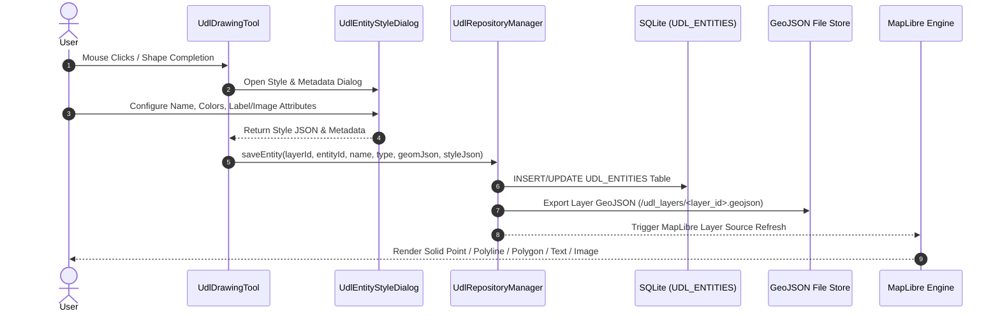
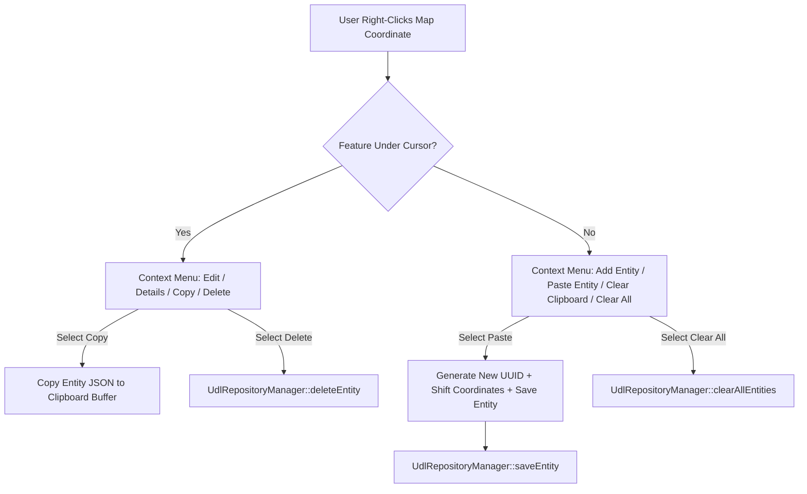
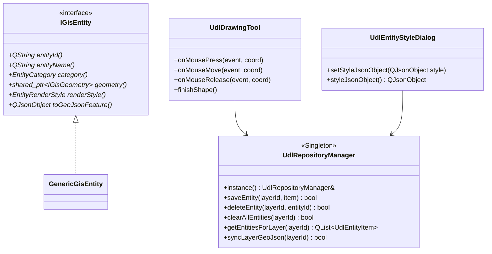

# 🏛 GISAPP Architecture & System Design Specification (v9.0)

> **Document Version**: 9.0.0  
> **Last Updated**: August 2026  
> **Target Framework**: C++17 / Qt6 (`QtWidgets`, `OpenGL`, `Network`, `Sql`, `Concurrent`, `Xml`, `Core`) / GDAL 3.x / MapLibre Native C++ SDK (`QMapLibre`)

---

## 📋 Executive Overview & What's New in Version 9.0

**GISAPP** is an enterprise-grade, high-performance 4D Tactical GIS Command-and-Control (C2) desktop application designed for mission-critical situational awareness. It integrates hardware-accelerated vector and raster rendering, real-time spatial telemetry ingestion (UDP tracks and radar coverage), offline multi-format layer publishing (GeoTIFF, Shapefile, VRT), on-demand local tile streaming, asynchronous background task execution, and an interactive **User Defined Layer (UDL)** entity management suite.

### 🚀 Major Architectural Advancements in Version 9.0

1. **User Defined Layer (UDL) Entity Management Subsystem**:
   - Integrated `UdlRepositoryManager` singleton for thread-safe SQLite persistence (`UDL_ENTITIES` table) storing flexible JSON attributes (`GEOMETRY_JSON`, `STYLE_JSON`).
   - Implemented real-time GeoJSON disk synchronization per layer (`/home/aman/MAPDATA/udl_layers/*.geojson`).
   - Built a comprehensive interactive drawing tool (`UdlDrawingTool`) supporting Points, Polylines, Polygons, Geodesic Meter Circles, Text Labels, and Geo-Referenced Image overlays.

2. **Refined Solid Point Entity Rendering Engine**:
   - Upgraded MapLibre `circle` layer paint configuration (`circle-stroke-width = 0.0` and color synchronization) to render solid, filled points without contrasting border rings.
   - Synchronized point fill/stroke attributes across `UdlDrawingTool`, `UdlEntityStyleDialog`, and `UdlToolbarWidget`.

3. **Spatial Map Context Menu & Entity Clipboard System**:
   - Implemented native MapLibre right-click map context menus providing direct spatial actions: *Add Entity*, *Edit Entity*, *Show Entity Details*, *Copy Entity*, *Paste Entity*, *Clear Clipboard*, and *Clear All Entities in Layer*.
   - Built an in-memory entity clipboard supporting cross-layer duplication with automated unique ID generation (`uuid_suffix`).

4. **Administrative Bulk Maintenance & Undo/Redo Engine**:
   - Integrated bulk deletion (`clearAllEntities(layerId)`) with SQLite atomic transactions, GeoJSON sync, and QUndoStack state cleanup.
   - Added user controls in both `UdlEntityTableDialog` and right-click map context menus.

5. **Advanced Entity Styling & Asset Handling**:
   - Expanded `UdlEntityStyleDialog` supporting custom font properties (family, size, weight, color, background box, opacity) for Text Labels.
   - Added support for Geo-Referenced Image overlays with custom scaling, rotation, and dynamic MapLibre symbol texture atlas registration (`map->addImage()`).

6. **OOP & SOLID Modular Architecture for Future Entities**:
   - Standardized architectural blueprints for scaling UDL entities via `IUdlEntityStrategy` and `UdlEntityFactory`, enabling zero-touch core modification when adding complex entity types (e.g., MIL-STD-2525 symbols, 3D models, tactical wedges).

---

## 🏗 High-Level System Architecture (v9.0 Complete Graph)

```mermaid
graph TD
    subgraph Presentation & UI Layer
        MW[MainWindow C2 Coordinator]
        LTF[LayerTreeFloatingWidget]
        PLD[PublishLayerDialog Modeless]
        DSD[DownloadSatImageryDialog Modeless]
        BTD[BackgroundTaskDialog Modeless]
        TTD[TracksTableDialog Modeless]
        AOV[AreaOfViewTableDialog Modeless]
        ETD[UdlEntityTableDialog Modeless]
        ESD[UdlEntityStyleDialog Modeless/Modal]
        TB[UdlToolbarWidget Floating Palette]
        TSB[TacticalStatusBar Telemetry]
        OW[OverlayWidget Translucent HUD]
        TM_UI[ThemeManager Dark Styling]
    end

    subgraph Controllers & Facades
        MC[MapController]
        TM[ToolManager Strategy Context]
        LM[LayerManager Composite]
        LPS[LayerPublishingService Facade]
        BTM[BackgroundTaskManager]
        NM[NotificationManager Singleton]
    end

    subgraph UDL & Entity Management System (EMS)
        URM[UdlRepositoryManager Singleton]
        UDT[UdlDrawingTool Strategy]
        GER[GisEntityRegistry Factory]
        GE[GenericGisEntity Model]
        GREPO[GenericEntityRepository SQLite JSON]
        MGA[MapLibreGenericEntityAdapter Engine]
    end

    subgraph Telemetry & Track Subsystems
        TR[TrackRepository SQLite]
        MTA[MapLibreTrackAdapter]
        CTI[CsvTrackIngestor / UDP Handler]
        AVR[AreaOfViewRepository SQLite]
        MAA[MapLibreAreaOfViewAdapter]
        XAI[XmlAreaOfViewIngestor]
    end

    subgraph Background Execution & Strategy Subsystem
        PF[PublisherFactory]
        RPS[RasterLayerPublisher Strategy]
        VPS[VectorLayerPublisher Strategy]
        GSDT[GoogleSatDownloaderTask Task]
        FNC[FlashNotificationStrategy Toast]
        CNS[CriticalNotificationStrategy Alert]
    end

    subgraph Data & Persistence Layer
        LTS[LocalTileServer Embedded HTTP:8088]
        LRM[LayerRegistryManager JSON Persistence]
        DBM[DatabaseManager SQLite]
        SCM[SystemConfigManager Workspace Path]
        FS_UDL[GeoJSON Layer Files /udl_layers/*.geojson]
    end

    subgraph Map Rendering Core
        MLW[MapLibreWidget OpenGL Viewport]
        MLA[MapLibreLayerAdapter Bridge]
        QML[QMapLibre::Map Engine]
    end

    MW --> MC
    MW --> TM
    MW --> LM
    MW --> LPS
    MW --> BTM
    MW --> NM

    MW --> URM
    MW --> GREPO
    MW --> TR
    MW --> AVR

    TM --> UDT
    UDT --> URM

    URM --> DBM
    URM --> FS_UDL
    URM --> QML

    NM --> FNC
    NM --> CNS

    LPS --> PF
    PF --> RPS
    PF --> VPS
    LPS --> QtConcurrent[QtConcurrent Worker Pool]

    BTM --> GSDT
    GSDT --> GDAL[GDAL / OGR Subsystem]

    GER --> GE
    GREPO --> DBM
    MGA --> GREPO
    MGA --> QML

    TR --> DBM
    MTA --> TR
    MTA --> QML
    CTI --> TR

    AVR --> DBM
    MAA --> AVR
    MAA --> QML
    XAI --> AVR

    LM --> LRM
    LM --> MLA
    MLA --> QML
    MLA --> LTS

    LTS --> GDAL
```

---

## 📊 Detailed Flow Diagrams

### 1. UDL Entity Lifecycle & Persistence Sequence

This sequence depicts interactive drawing, SQLite database commit, GeoJSON disk sync, and MapLibre viewport rendering:



---

### 2. Spatial Context Menu & Entity Clipboard Flow



---

### 3. SOLID & OOP Layer Architecture for UDL Entities



---

## 🧱 Subsystem Architecture Breakdown

### 1. User Defined Layer (UDL) Subsystem

- **`UdlRepositoryManager` (Singleton Repository Pattern)**:
  - Central manager for all user-created spatial features.
  - Interacts directly with the SQLite database (`UDL_ENTITIES` table) storing:
    - `entity_id` (TEXT PRIMARY KEY)
    - `layer_id` (TEXT)
    - `entity_name` (TEXT)
    - `entity_type` (TEXT: Point, Polyline, Polygon, Circle, Text, Image)
    - `geometry_json` (JSON BLOB)
    - `style_json` (JSON BLOB)
    - `created_at` (TIMESTAMP)
  - Synchronizes changes to GeoJSON files (`/home/aman/MAPDATA/udl_layers/<layer_id>.geojson`).

- **`UdlDrawingTool` (Interactive Shape Strategy)**:
  - Handles mouse press, drag, and release events to build spatial geometries.
  - Supports geodesic meter circles (using 64-vertex trigonometry calculations).
  - Handles Point, LineString, Polygon, Text, and Image placement.

- **`UdlEntityStyleDialog` & `UdlToolbarWidget` (Dynamic Form UI)**:
  - Dynamically builds UI property forms based on `UdlGeometryType`.
  - Ensures point entity stroke and fill colors are synchronized for solid dot rendering.
  - Supports custom fonts, text labels, opacity sliders, and image asset selection.

- **`UdlEntityTableDialog` (Tabular Data Management)**:
  - Displays entity lists per layer with search filtering.
  - Provides quick action buttons: **Edit**, **Delete**, and **🗑️ Clear All Entities**.

---

### 2. Telemetry, Tracks & Sector Subsystems

- **`TrackRepository` & `MapLibreTrackAdapter`**:
  - Processes real-time track records via CSV or UDP telemetry.
  - Maps affiliation colors (`FRIENDLY`, `HOSTILE`, `NEUTRAL`, `UNKNOWN`) into dynamic MapLibre vector layers.

- **`AreaOfViewRepository` & `MapLibreAreaOfViewAdapter`**:
  - Ingests sector coverage XML files.
  - Generates radar wedge polygons and updates MapLibre sector overlay layers.

---

### 3. Layer Publishing & Embedded Tile Server

- **`LayerPublishingService` & `IPublisherStrategy`**:
  - Offloads heavy GDAL raster processing (`gdalbuildvrt`, `gdaladdo`) and vector conversions (`ogr2ogr`) to background `QtConcurrent` worker threads.
- **`LocalTileServer` (Embedded HTTP:8088)**:
  - Serves Web Mercator XYZ tiles on demand.
  - Features a thread-safe LRU tile cache capped at **500 items**.

---

## 📁 Directory & File Layout (v9.0)

```
GISAPP/
├── DOCUMENTS/
│   ├── Arch.md                    # Historical v1-v3 Architecture
│   ├── archv4.md                  # v4.0 System Architecture
│   ├── archv5.md                  # v5.0 Architecture Document
│   └── archv9.md                  # Current v9.0 System Architecture Specification
├── config/
│   ├── published_layers.json      # Persistent layer registry state
│   └── system_config.json         # Workspace storage paths
└── src/
    ├── main.cpp                   # Application entrypoint (OpenGL setup)
    ├── core/                      # Core Models & Repositories
    │   ├── database/
    │   │   └── DatabaseManager.h/.cpp # SQLite connection pool
    │   ├── models/
    │   │   ├── IGisEntity.h       # Polymorphic entity abstract interface
    │   │   └── GenericGisEntity.h/.cpp # EMS generic entity model
    │   └── repositories/
    │       └── GenericEntityRepository.h/.cpp # SQLite JSON entity repo
    ├── tools/
    │   ├── UdlDrawingTool.h/.cpp  # UDL drawing tool strategy
    │   ├── PanTool.h/.cpp         # Map pan strategy
    │   └── MeasureTool.h/.cpp     # Geodesic distance tool strategy
    ├── publishing/
    │   ├── UdlRepositoryManager.h/.cpp # UDL entity & layer persistence
    │   ├── LocalTileServer.h/.cpp # Embedded HTTP tile server with LRU cache
    │   └── LayerPublishingService.h/.cpp # Async layer publisher facade
    ├── map/
    │   ├── MapLibreWidget.h/.cpp  # MapLibre OpenGL viewport
    │   └── OverlayWidget.h/.cpp   # Translucent QPainter HUD
    └── ui/
        ├── mainwindow.h/.cpp      # Main C2 UI Coordinator
        └── udl/
            ├── UdlEntityStyleDialog.h/.cpp # Entity style configuration UI
            ├── UdlEntityTableDialog.h/.cpp # Entity table management dialog
            └── UdlToolbarWidget.h/.cpp     # UDL drawing tool palette
```

---

## ⚡ Performance Benchmark Matrix (v9.0)

| Subsystem | Operation | Execution Mode | GUI Thread Impact |
| :--- | :--- | :--- | :--- |
| **UDL Entity SQLite Save** | Single Entity Insert/Update | SQLite Atomic Transaction | **< 1.5 ms** |
| **UDL GeoJSON File Sync** | Export Layer to GeoJSON File | Synchronous Disk Write | **< 3.0 ms** |
| **UDL Bulk Clear All** | Bulk Delete Layer Entities | SQLite Transaction + File Sync | **< 4.0 ms** |
| **MapLibre Point Rendering** | Solid Point Render (No Casing) | GPU Hardware Shader | **60 FPS (0 ms)** |
| **Track CSV Ingestion** | 1000+ Track Records | Threaded SQLite Commit | **0 ms (Non-blocking)** |
| **Tile Streaming Server** | VRT Tile Fetch (Port 8088) | LRU Cache / GDAL Worker | **< 2.0 ms per tile** |

---

> **End of Architecture Specification v9.0**
